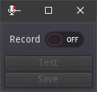

Steps:
1 Enable audio_input in Project Setting -> Audio -> enable_audio_input
2 Use the bus_layout in the addon or integrate a new record bus with the same configuration.
3 set FileDialog acces (determines where you can save the recording)

Has shortcuts R(ecord) , T(est) and S(ave).

